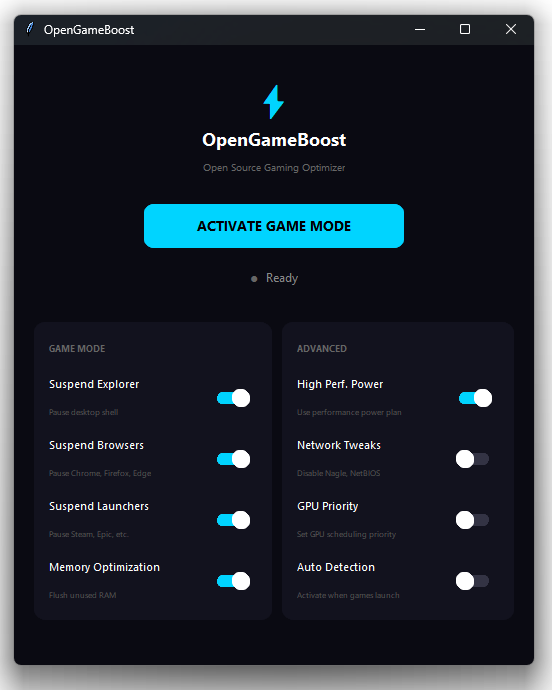

# OpenGameBoost

[](https://deepwiki.com/bensheed/OpenGameBoost)

Open source gaming optimizer for Windows 10/11.



## Overview

OpenGameBoost is a transparent, open-source alternative to closed-source gaming optimization tools. All code is visible and auditable - no hidden functionality, no telemetry, no malware concerns.

## Features

### Game Mode Modules

- **Suspend Explorer** - Suspends explorer.exe to free CPU and RAM
- **Suspend Browsers** - Suspends Chrome, Firefox, Edge, Opera, Brave, and other browsers
- **Suspend Launchers** - Suspends Steam, Epic Games, Battle.net, EA, Ubisoft Connect, GOG, and other game launchers

All processes are suspended (not killed) and resume instantly when Game Mode is deactivated.

### Advanced Optimizations

- **Memory Optimization** - Flushes unused memory from processes using Windows EmptyWorkingSet API
- **High Performance Power** - Switches to High Performance power plan, restores original on deactivation
- **Network Optimization** - Disables Nagle's algorithm and NetBIOS for reduced latency
- **GPU Priority Tweaks** - Sets GPU scheduling priority for games via registry
- **Auto Game Detection** - Automatically activates Game Mode when supported games are launched

### Supported Games (Auto Detection)

Call of Duty, Fortnite, Apex Legends, Counter-Strike 2, Valorant, League of Legends, DOTA 2, Overwatch, GTA V, Red Dead Redemption 2, Cyberpunk 2077, Minecraft, Valheim, Elden Ring, Baldur's Gate 3, Diablo IV, Path of Exile, World of Warcraft

## Requirements

- Windows 10 or Windows 11 (64-bit)
- Administrator privileges (required for process suspension and system modifications)
- Python 3.9+ (if running from source)

## Installation

### Option 1: Pre-built Executable

Download `OpenGameBoost.exe` from Releases and run as Administrator.

### Option 2: Run from Source

```
git clone https://github.com/opengameboost/opengameboost.git
cd opengameboost
pip install -r requirements.txt
python main.py
```

### Option 3: Build Executable

```
pip install -r requirements.txt
python build.py
```

Output: `dist/OpenGameBoost.exe`

## Usage

1. Run OpenGameBoost as Administrator
2. Configure toggles as desired
3. Click "Activate Game Mode"
4. Launch your game
5. Click "Deactivate Game Mode" when finished

## Project Structure

```
OpenGameBoost/
├── main.py                 # Application entry point and UI
├── config.py               # Configuration management
├── build.py                # PyInstaller build script
├── requirements.txt        # Python dependencies
├── services/
│   ├── suspend_service.py  # Process suspension (core feature)
│   ├── memory_service.py   # Memory optimization
│   ├── power_service.py    # Power plan management
│   ├── network_service.py  # Network optimizations
│   ├── registry_service.py # GPU and registry tweaks
│   └── game_detector.py    # Game detection
├── installer.iss           # Inno Setup installer script
└── assets/                 # Icons and resources
```

## Technical Details

### Process Suspension

Uses Windows NT API functions `NtSuspendProcess` and `NtResumeProcess` to suspend and resume processes without terminating them.

### Memory Optimization

Calls `PSAPI.EmptyWorkingSet` on running processes to flush unused memory pages to disk.

### Network Optimization

Modifies registry keys to:
- Disable Nagle's algorithm (TcpNoDelay, TcpAckFrequency)
- Disable NetBIOS over TCP/IP
- Disable LLMNR multicast

### Power Management

Uses `powercfg` to switch between power plans and detect system type (desktop/laptop).

## License

MIT License. See LICENSE file for details.

## Disclaimer

This software modifies Windows system settings. All changes are reversible. Use at your own risk. The authors are not responsible for any issues that may arise from using this software.
